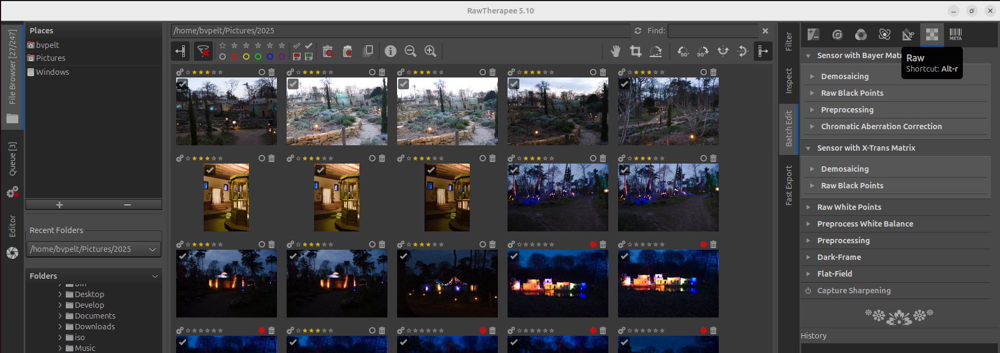
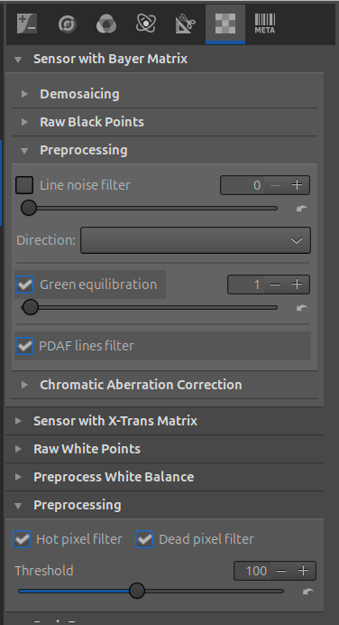

# Rawtherapee

This document describes using rawtherapee for a newbie like me.

Currently I have a sony digital camera which has the possibility to take raw pictures .arw files.

This document assumes using rawtherapee 5.10 on Ubuntu 24.04.

## Setup

For Sony ARW files, you must use Sensor with Bayer Matrix → Demosaicing Never the X-Trans section.
Sony ARW = Bayer sensor

All Sony cameras that produce ARW files use a Bayer CFA (Color Filter Array).
- Sony does not use X-Trans sensors
- X-Trans is Fujifilm-only

So RawTherapee exposes two demosaicing pipelines:
- Bayer Matrix → Canon, Nikon, Sony, Panasonic, Leica, etc.
- X-Trans Matrix → Fujifilm only

RawTherapee does not auto-switch visually — both sections are always visible, but only one is actually used depending on the file.

For ARW files:
- The Bayer section is active
- The X-Trans section is ignored entirely

### RAW Tab (Most Important for Sony)

RAW tab → Sensor with Bayer Matrix

#### Demosaicing (Bayer)
- Method: AMaZE, this will use border handling
- False Color Suppression: 2

Optional:

For high ISO (>3200):
- Method: RCD instead of AMaZe

#### Preprocessing

*Global processing:*

- Fix broken pixels
- Sensor-agnostic
- Happens very early

Settings:
- Hot Pixel Filter: On
- Dead Pixel Filter: On
- Threshold: 100

*Bayer Matrix processing*

For Sony specific artifacts
- Fix patterns created by sensor design
- Happens just before demosaicing
- Highly camera-specific

Settings apply to:
- Line noise filter
- Direction
- Green equilibration
- PDAF lines filter

##### Line Noise Filter

Use sparingly
- Enable: ❌ OFF by default
- Enable only if you see banding
- If needed:
    - Direction: Horizontal
    - Strength: 1–2

Sony files usually do not need this unless you push shadows very hard.

##### Green Equilibration

Recommended for Sony
- Enable: ✅ ON
- Value: 1

Why:
- Sony sensors sometimes show slight green channel imbalance
- This improves color consistency, especially in shadows

This is subtle but beneficial.

##### PDAF Lines Filter (Very Important for Sony)

Sony cameras use on-sensor PDAF.
- Enable: ✅ ON
- Only applies if your camera has PDAF (most modern Sonys do)

Why:
- PDAF rows can produce:
    - Horizontal stripes
    - Grid-like artifacts
    - Color inconsistencies when lifting shadows

This filter is cheap and safe — keep it enabled.

##### Direction “Horizontal only on PDAF rows”

Use this only if:
- You see residual PDAF artifacts
- Otherwise, leave it alone

Default behavior is usually sufficient.

Sony sensors occasionally show hot pixels in shadows — keep this enabled.

▶ Black Level & White Point

Leave default

Sony ARW metadata is reliable here

2. Color Tab
▶ Input Profile

Input Profile: Auto-matched camera profile

DCP Illuminant: As Shot

This gives you Sony-like color without baking in heavy contrast.

📌 If you prefer a flatter base:

Try Camera Standard → compare

▶ White Balance

Method: Camera

Fine-tune manually per image

Sony AWB is good but slightly cool; don’t hesitate to warm slightly.

▶ Color Calibration (Highly Recommended)

This replaces crude saturation sliders.

Enable Color Calibration

Mode: Chromaticity

Global Saturation: +5 to +8

Avoid channel tweaks unless necessary

This keeps skin tones natural (very important for Sony).

▶ Vibrance

Amount: +10 to +15

Pastel Protection: On

Avoid the Saturation slider unless you know why you’re using it.

3. Exposure Tab
▶ Exposure

Exposure Compensation: Adjust per image

Highlight Reconstruction: Color Propagation

Sony highlights recover very well — use this early.

▶ Shadows / Highlights

Shadows: +10 to +20

Highlights: -10 to -20

Tonal Width: default

Subtle adjustments only — Sony files don’t like heavy shadow lifting.

4. Tone Mapping & Contrast
▶ Tone Curve

Use Parametric Tone Curve

Gentle S-curve:

Slight lift in highlights

Slight dip in shadows

Avoid aggressive curves — Sony already has strong micro-contrast.

▶ Local Contrast

Amount: +10

Radius: default

Avoid at high ISO

Optional but very effective for landscapes.

5. Detail Tab
▶ Noise Reduction (Zoom to 100%)

Sony ARW has clean luminance noise but visible chroma noise.

Chrominance NR

Amount: 20–30

Auto color detection: On

Luminance NR

Amount: 5–15 (ISO dependent)

Detail: 50

Contrast: 0–10

📌 Always adjust per ISO — do not bake strong NR into your default.

▶ Sharpening

Use Capture Sharpening only.

Method: RL Deconvolution

Radius: 0.7

Amount: 100

Damping: 20

Sony files sharpen extremely well — don’t oversharpen.

6. Lens / Geometry
▶ Lens Correction

Enable Automatic Lens Correction

Check:

Distortion

Vignetting

Chromatic Aberration

Sony lens metadata is excellent.

▶ Defringe

Purple Fringe Removal: On

Strength: default

7. Transform Tab

Rotate / Crop as needed

Do this after lens correction

8. Output Settings (Queue)
▶ Color Management

Output Profile: sRGB (web)

Rendering Intent: Perceptual

▶ Output Sharpening

Enable

Low for web

Off for print TIFFs

Save This as a Default Sony Profile

Apply settings to one ARW

Processing Profile → Save Current Profile

Name it:

Sony_ARW_Base_5.10.pp3

Set as default for Sony cameras

Quick Sony-Specific Tips

Sony files hate aggressive clarity

Prefer Color Calibration over Saturation

Don’t over-lift shadows (green/magenta noise)

Always judge noise at 100%