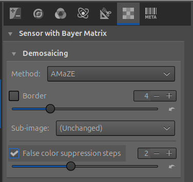
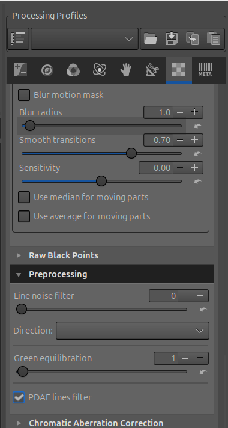
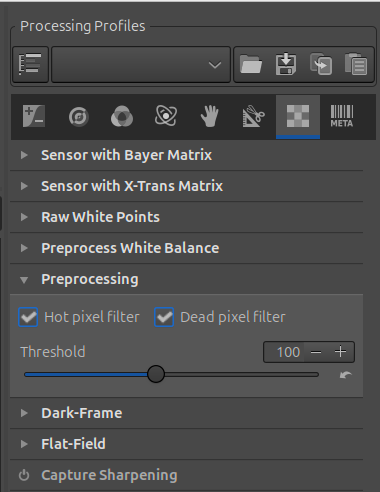
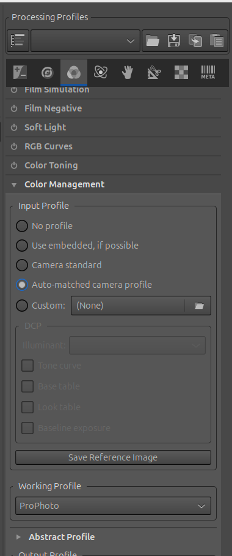
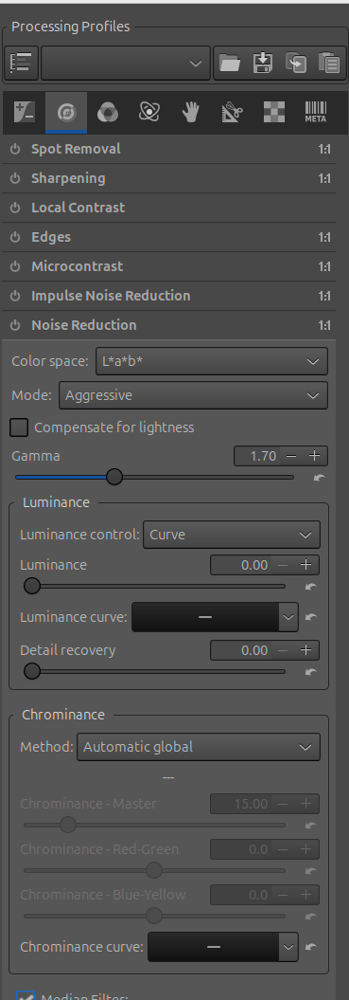
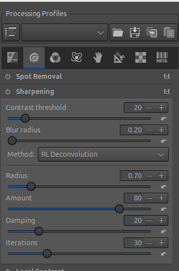
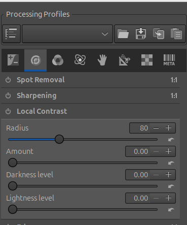
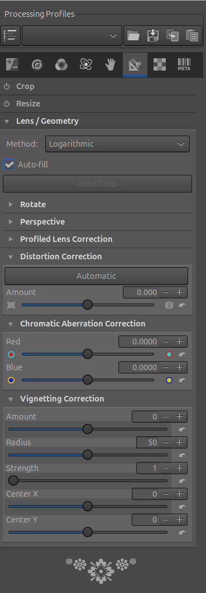

# Best Batch-Processing Base Settings

Sony ARW in RawTherapee 5.10

Important principles (read once)
- Batch processing in RawTherapee = apply a saved processing profile (.pp3)
- You must configure settings in the Editor first
- Batch settings must be:
    - Sensor-safe
    - Lighting-agnostic
    - Conservative

## STEP 1 — Open ONE representative ARW in the Editor

Choose:
- Typical exposure
- Typical ISO
- Typical lighting for the shoot

Everything below is set in the Editor, then saved as a profile.

## STEP 2 — RAW Tab (Sony-specific, batch-safe)

*RAW → Sensor with Bayer Matrix → Demosaicing*

| Setting                 | Value |
|-------------------------|------:|
| Method                  | AMaZE |
| False color suppression | 2     |
| Dual demosaicing	      | OFF   | 

The Dual demosaicing option is not available in the rawtherapee 5.10 ui. The value cannot be set and is OFF by default.

📌 AMaZE is best for low–mid ISO.
(If most of your shoot is ISO > 3200, make a second profile using RCD.)

*RAW → Sensor with Bayer Matrix → Preprocessing*

| Setting             | Value  |
|---------------------|--------|
| Green equilibration | ON (1) |
| PDAF lines filter	  | ON     |
| Line noise filter	  | OFF    |

Sony cameras use on-sensor PDAF — this avoids banding when shadows are lifted.

*RAW → Preprocessing (global)*

| Setting           | Value |
|-------------------|-------|
| Hot pixel filter  | ON    |
| Dead pixel filter	| ON    |
| Threshold	        | 100   |

Safe and inexpensive; good for batch use.

## STEP 3 — Color Tab (batch-safe)

*Color → Color Management*

| Setting	      | Value                       |
|-----------------|-----------------------------|
| Input profile	  | Auto-matched camera profile |
| Working profile | ProPhoto RGB (default)      |

*Color → White Balance*

| Setting	| Value  |
|-----------|--------|
| Method    | Camera |

📌 Do not batch-apply manual WB unless lighting is identical.
[white balance](./images/menu-color-whitebalance.png)

*Color → Vibrance*

| Setting	              | Value    |
|-------------------------|---------:|
| Pastel tones            | ON → +10 |
| Saturated tones         | ON → +5  |
| Link pastel & saturated | OFF      |
| Protect skin-tones      | ON       |
| Avoid color shift       | ON       |

[vibrance](./images/menu-color-vibrance.png)

## STEP 4 — Exposure Tab (very conservative)
*Exposure → Exposure*
- Leave Exposure Compensation = 0

Batch exposure correction is unsafe — adjust per image if needed.
[exposure](./images/menu-exposure-exposure.png)

*Exposure → Shadows / Highlights*

| Setting	         | Value              |
|--------------------|-------------------:|
| Color space        | L\*a\*b\*             |
| Highlights         | ON → 10            |
| Shadows            | ON → 10            |
| Tonal width (both) | minimum value → 10 |
| Radius	         | minimum value → 10 |

This gently protects highlights and opens shadows without noise blow-up.
[shadows](./images/menu-exposure-shadows.png)

*Exposure → Tone Equalizer/Mapping*
Do not change the default settings.

## STEP 5 — Detail Tab (batch-safe)
*Detail → Noise Reduction*

| Setting	     | Value  |
|----------------|--------|
| Luminance NR	 | OFF    |
| Chrominance NR |ON → 15 |

 

📌 Luminance noise varies too much for batch processing.
Chroma NR at 15 is safe even at low ISO.

*Detail → Sharpening*

| Setting	| Value |
|-----------|-----------------:|
| Method	| RL Deconvolution |
| Radius	| 0.7              | 
| Amount	| 80               |
| Damping	| 20               |

This is capture sharpening only — safe for all outputs.

*Detail → Local Contrast*
| Setting  | Value |
|----------|-------|
| Enable   | OFF   |

Local Contrast is scene-dependent — don’t batch it.

 

## STEP 6 — Transform / Lens(safe)
Lens → Automatic Lens Correction
- ON (Distortion + Vignetting + CA)

Transform
- Leave OFF for batch (crop/rotate later if needed)

## STEP 7 — Save as a Batch Profile

1. Open one ARW image in the Editor
2. Look at the right-hand panel, near the top
3. Find the Processing Profile section
(it shows the currently active profile name)
4. Click the disk / save icon next to the profile name
(or the small menu button, depending on your theme)

Choose:
- Save current profile…
- Enter a name, for example:
>>> Sony_ARW_Batch_Base_RT5.10.pp3

Confirm

✅ The profile is now saved.

## STEP 8 — Batch Process in File Browser

1. Go to File Browser
2. Select all .ARW files
3. Right-click → Processing Profile
4. Apply Sony_ARW_Batch_Base_RT5.10.pp3
5. Send to Queue
6. Start processing

## Optional: Two-Profile Strategy (Recommended)

| Profile	              | Use case                  |
|-------------------------|---------------------------|
| Sony_ARW_Batch_Base	  | ISO ≤ 1600                |
| Sony_ARW_Batch_HighISO  |	AMaZE → RCD, Chroma NR 25 |

## Final Takeaway

This setup:
- Matches RawTherapee 5.10 UI exactly
- Is Sony ARW–specific
- Is safe for hundreds of images
- Avoids scene-dependent edits
-  Produces neutral, flexible results